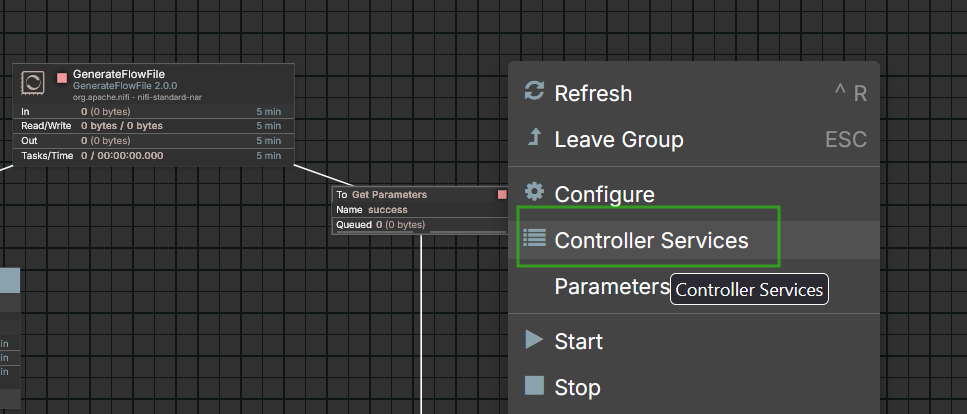

# DOCKER COMPOSE WITH POSTGRESQL DRIVER

### Step 1: 
 Copy current [docker compose](./docker-compose.yml) and postgresql driver files in the same directory.  

 


## Step 2:
-  Verify docker-compose.yml and check if you need to change any port.   If there are conflict please change.
-  Consider changing your username or password..  


```yml
version: '3'

services:
  nifi:
    cap_add:
      - NET_ADMIN # low port bindings
    image: apache/nifi:2.0.0
    environment:
      - TZ=America/Montreal    # By default container with Montreal tyme zone (change if neccesary. )
      - NIFI_WEB_HTTP_HOST=nifi
      - SINGLE_USER_CREDENTIALS_USERNAME=nifi-projet123   # You can change for desired user
      - SINGLE_USER_CREDENTIALS_PASSWORD=nifi-projet123   # You can change for desired password
      
    container_name: nifi
    ports:
    # Check if you need to changes the port before the colon ":"
      - "58081:8080/tcp" # HTTP interface.   
      - "8443:8443/tcp" # HTTPS interface
      - "514:514/tcp" # Syslog
      - "514:514/udp" # Syslog
      - "2055:2055/udp" # NetFlow
    volumes:
    # Check the persistent volumes names are not equal to any docker previous installation
      - nifi-drivers:/opt/nifi/nifi-current/drivers   
      - nifi-certs:/opt/certs
      - nifi-conf:/opt/nifi/nifi-current/conf
    # Copy postgresql driver in container.     
      - ./postgresql-42.7.4.jar:/opt/nifi/nifi-current/drivers/postgresql-42.7.4.jar
      
    restart: unless-stopped

volumes:
  nifi-drivers:
    name: nifi-drivers
  nifi-certs:
    name: nifi-certs
  nifi-conf:
    name: nifi-conf
```


## Step 3:
-  Open command line (terminal) in the current directory of [docker compose](./docker-compose.yml) and postgresql driver files.

## Step 4:
-  To execute this command, ensure Docker is installed beforehand.

```powershell
docker compose up -d
```

or alternative

```powershell
docker-compose up -d
```

## Step 5:
-  Open nifi in the browser,  change the port if you has prevously modify this [docker compose](./docker-compose.yml) file.

```http
https://localhost:8443/
```

## Step 6:
-  A warning appears. Click the 'Advanced' button, then click 'Accept the risk and continue'

## Step 7:
-  Write user and password related with this [docker compose](./docker-compose.yml) file.

```text
username:  nifi-projet123
password:  nifi-projet123
```

-  You must be in nifi Canvas.


#

# LOAD A FLOW DEFINITION IN YOUR CANVAS

## Step 1:
-  Drag and drop a process group into the canvas


## Step 2:
-  Click on Browse to find the flow definition file, is a JSON file.   No matter with the name of the file.  


## Step 3:
-  Once file has been selected, click on add


## Step 4:
-  A Process group is created with the corresponding flow definition.


## Step 5:
-  Double click in process group.   You will see all the schema and sub-process.


## Step 6:
-  Go to parameter contextS to change IP, PORTS, USER and PASSWORD


## Step 7:
-  Click on empty space in the canvas and click on Controller services in contextual menu.



## Step 8:
-  You will see the list of all Controller services,  go to DBCPConnectionPool_POSTGRES the only you need to edit is Database prostres user and password.


## Step 9:
-  By default all controller services are disable.  Is neccesary to enable all. 


## Step 10:
-  To comeback to canvas select canvas in menu

